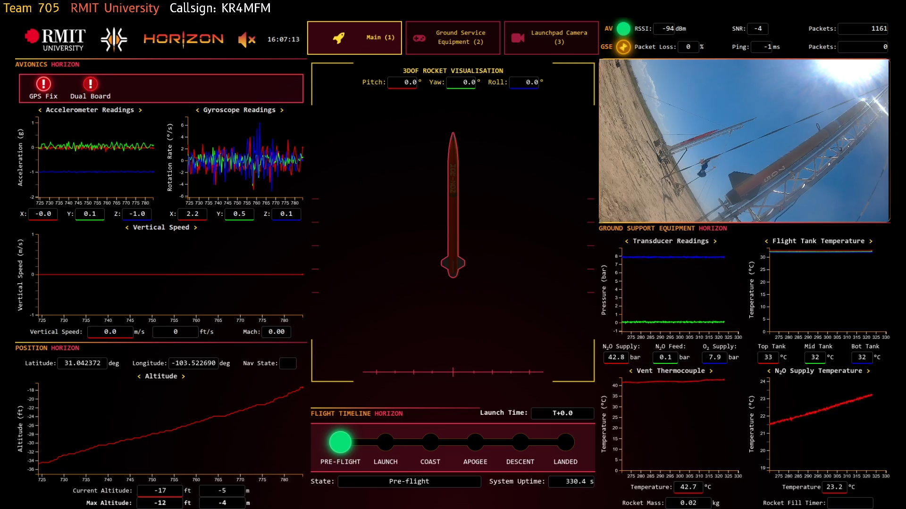
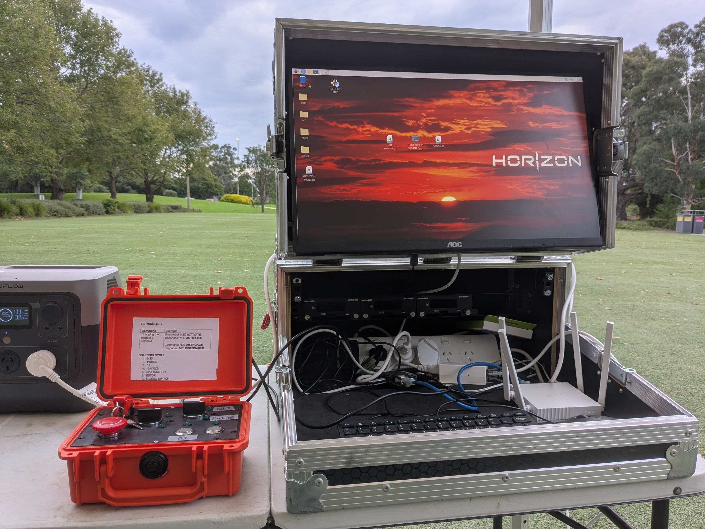

## Hi !!

I'm Amber Taylor (she/her). I'm a compsci student at RMIT University in Australia, working on the side as a software developer.

### RMIT High Velocity

I'm the current Ground Control Station lead for RMIT High Velocity Rocketry. I designed and built the [GCS Frontend](https://github.com/RMIT-Hive-Rocketry/GCS) for visualising and monitoring live telemetry data from the ground equipment and avionics, which I've been working on for the last year in preparation for [IREC 2026](https://www.esrarocket.org/2026irec)! 

### Other work

I have an alt GitHub account for personal projects and less professional work at <a href="https://github.com/gitchly/">
  @gitchly

</a>!!

<!--
**s4105951/s4105951** is a ✨ _special_ ✨ repository because its `README.md` (this file) appears on your GitHub profile.

Here are some ideas to get you started:

- 🔭 I’m currently working on ...
- 🌱 I’m currently learning ...
- 👯 I’m looking to collaborate on ...
- 🤔 I’m looking for help with ...
- 💬 Ask me about ...
- 📫 How to reach me: ...
- 😄 Pronouns: ...
- ⚡ Fun fact: ...
-->
